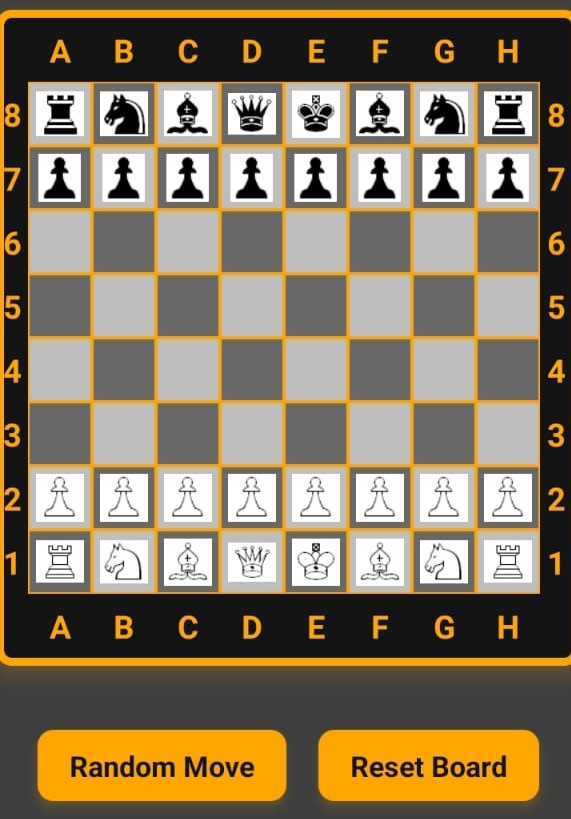

#  Avengen Chess Task

## **Setting up the development environment**

Follow React Native CLI Setup
https://reactnative.dev/docs/environment-setup

## Running Application

Clone the repo

Install dependencies with `yarn install`

Start the dev server with `yarn start`

Run with `yarn run android`

## Go to below link to download apk file

https://drive.google.com/file/d/1fl7v2NR11F7Y9fvW7C7rXZ7-gEHzQTQ2/view?usp=sharing
